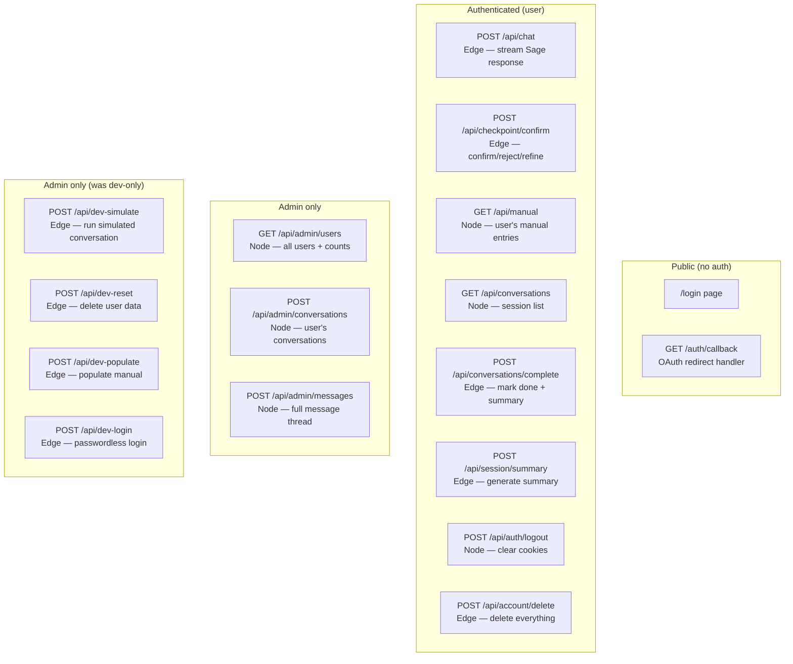
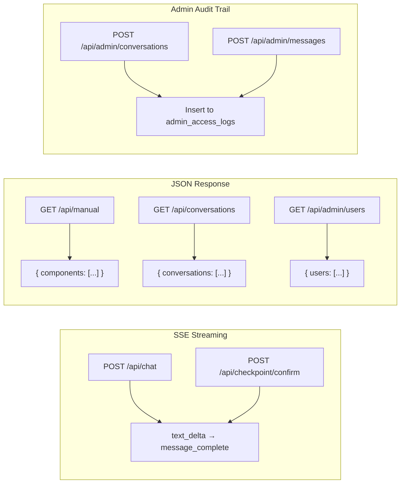

# API Route Map

Overview of all API routes, their runtimes, auth requirements, and data flow.

## Request/response patterns

## Auth verification pattern

Every authenticated route follows:
1. **Server client** calls `getUser()` to verify auth
2. **Admin client** (service role) does all database operations
3. Admin routes additionally call `verifyAdmin()` which checks JWT `app_metadata.role`
