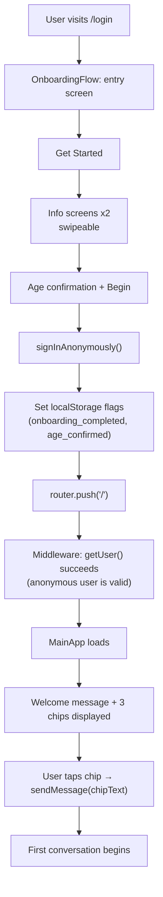
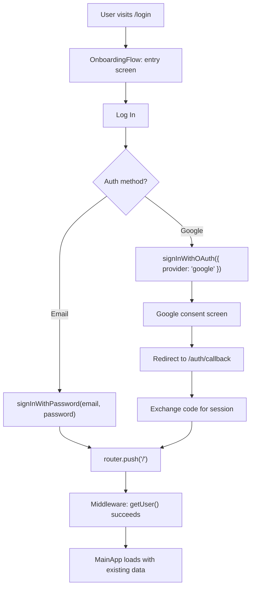
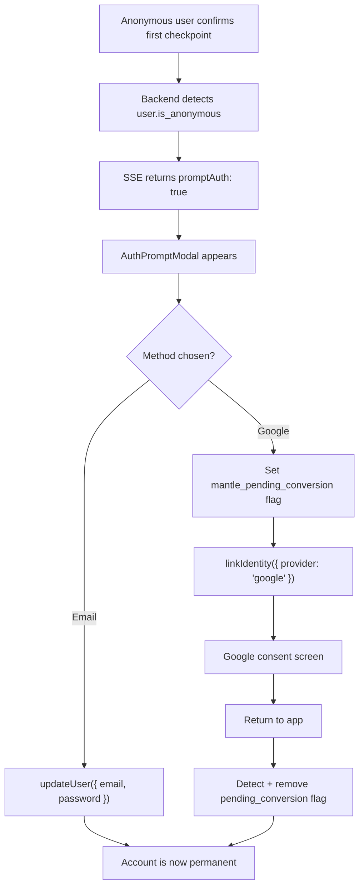
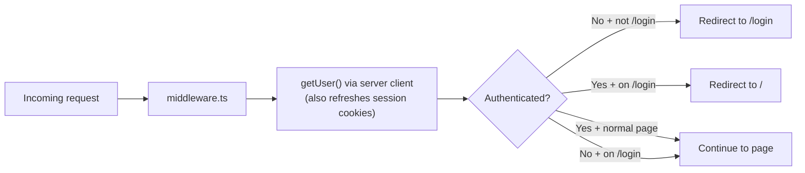

# User Authentication Flow

## New user (anonymous start)

## Returning user (email/password or Google)

## Guest-to-real conversion

## Middleware behavior

## Three Supabase clients

| Client | Where | Key used | Purpose |
|--------|-------|----------|---------|
| **Admin** | API routes only | Service role key | Bypasses RLS. All DB writes. |
| **Server** | API routes + middleware | Anon key + cookies | Auth verification only (getUser). |
| **Browser** | Client components | Anon key | Client-side auth + data reads through RLS. |
