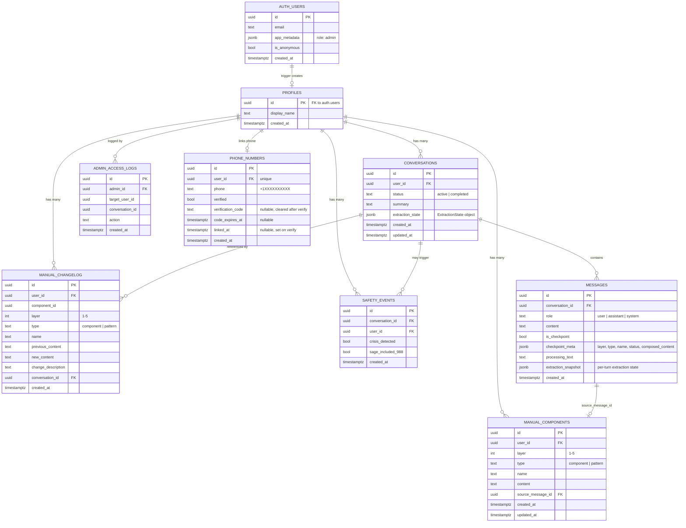

# Database Schema & Table Relationships

## Accumulation rules

- **Components**: Max 1 per layer per user (5 total). Upsert replaces existing.
- **Patterns**: Max 2 per layer per user. Same name = replace. 3rd pattern archives oldest to manual_changelog.
- **Unique indexes**: `unique_component_per_layer` (partial, type='component'), `unique_pattern_name_per_layer` (partial, type='pattern').

## The five layers

| Layer | Name |
|-------|------|
| 1 | What Drives You |
| 2 | Your Self Perception |
| 3 | Your Reaction System |
| 4 | How You Operate |
| 5 | Your Relationship to Others |
