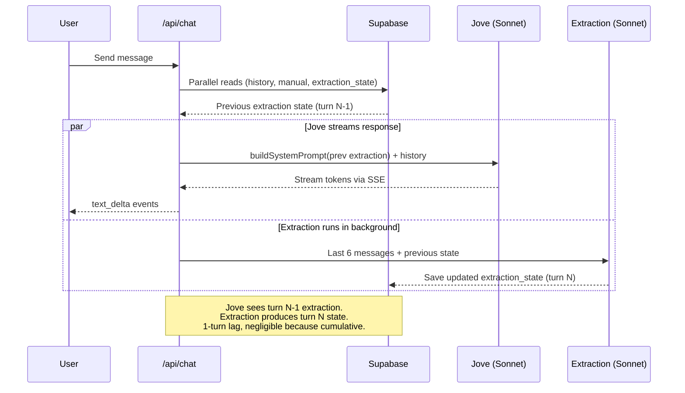
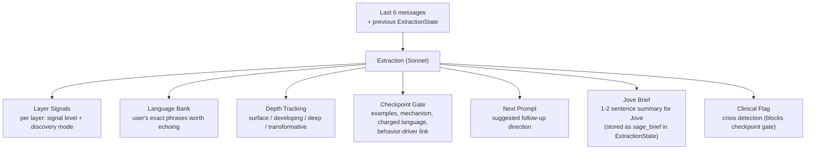
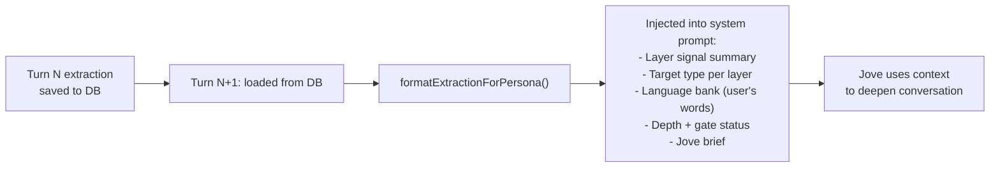

# Extraction Pipeline

The extraction layer runs in parallel with Jove to analyze conversation depth, track user language, and assess checkpoint readiness — without adding any latency.

## Per-turn flow

## What extraction produces

## How extraction feeds back into Jove

## Signal levels per layer

| Signal | Meaning |
|--------|---------|
| `none` | Layer not touched yet |
| `mentioned` | User briefly referenced this area |
| `emerging` | Patterns forming, worth exploring |
| `explored` | Rich material, approaching checkpoint |
| `checkpoint_ready` | Enough depth for a manual entry |
