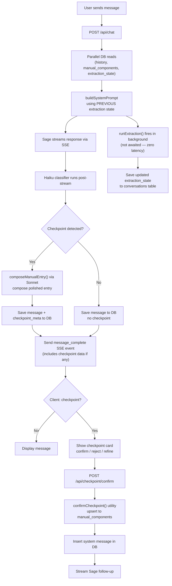

# Sage Conversation Pipeline

How a single user message flows through the system and produces a Sage response.

## Key design decisions

- **1-turn lag**: Sage always sees the PREVIOUS turn's extraction state. Since extraction is cumulative, the lag is negligible.
- **Single path**: Sage responds → Haiku classifier flags candidate turns → `composeManualEntry()` (Sonnet) writes the polished manual entry server-side. Sage never emits manual-entry blocks inline.
- **composed_content is never null on confirmed checkpoints**: Two defenses — server-side composition at detection time, and msg.content fallback in `confirmCheckpoint()`.
