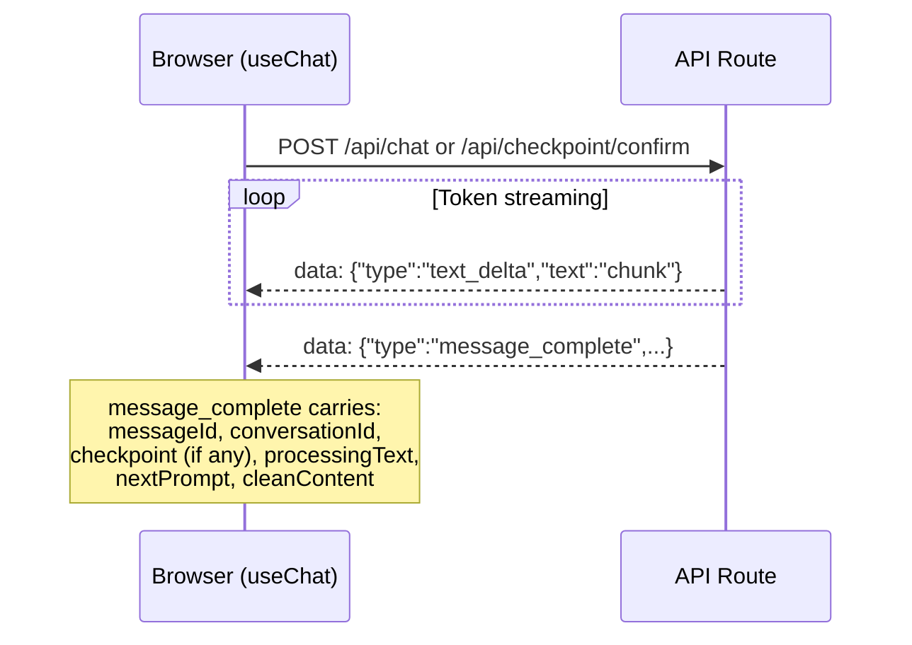
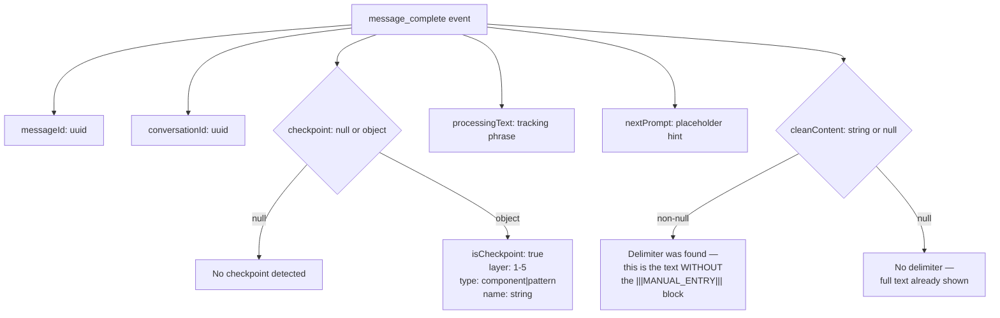
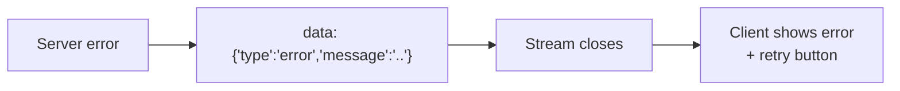

# SSE Streaming Protocol

All streaming responses (chat + checkpoint confirm) use the same event format.

## Event types

## Message complete payload

## Error handling

## Client-side parsing

The `parseSSEStream()` utility in `sse-parser.ts` handles:
- Chunked SSE data (may split across network packets)
- Malformed JSON recovery
- Null response body detection
- Buffered rendering (text shown in one shot, not streamed incrementally)
