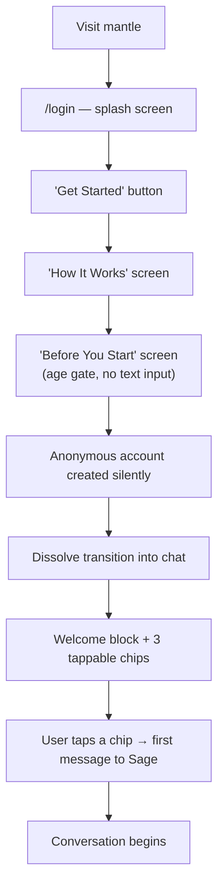
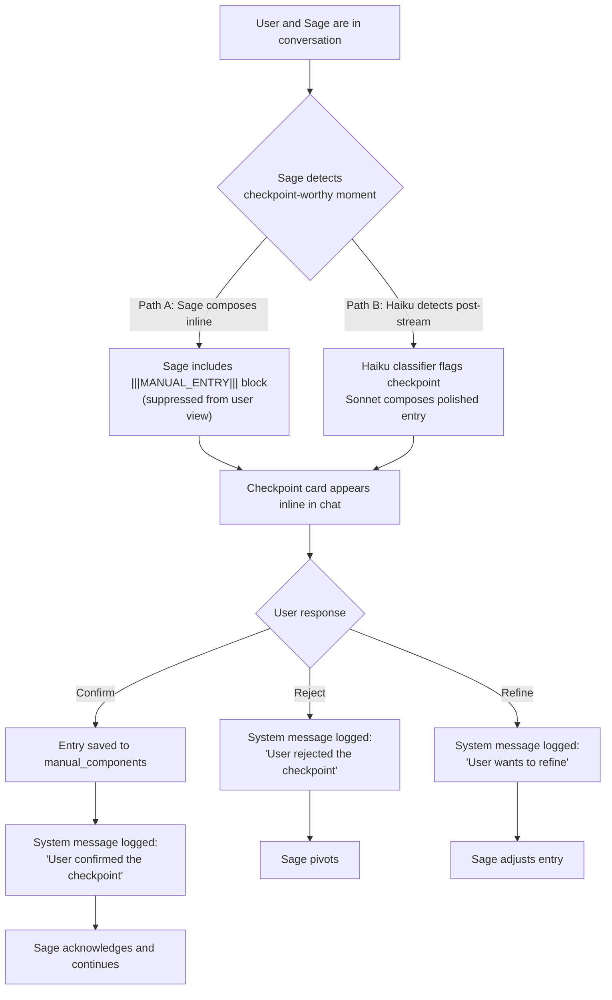
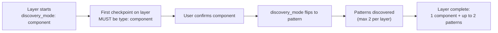
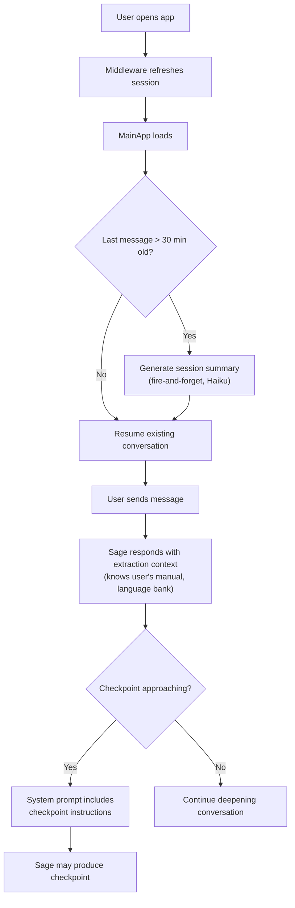
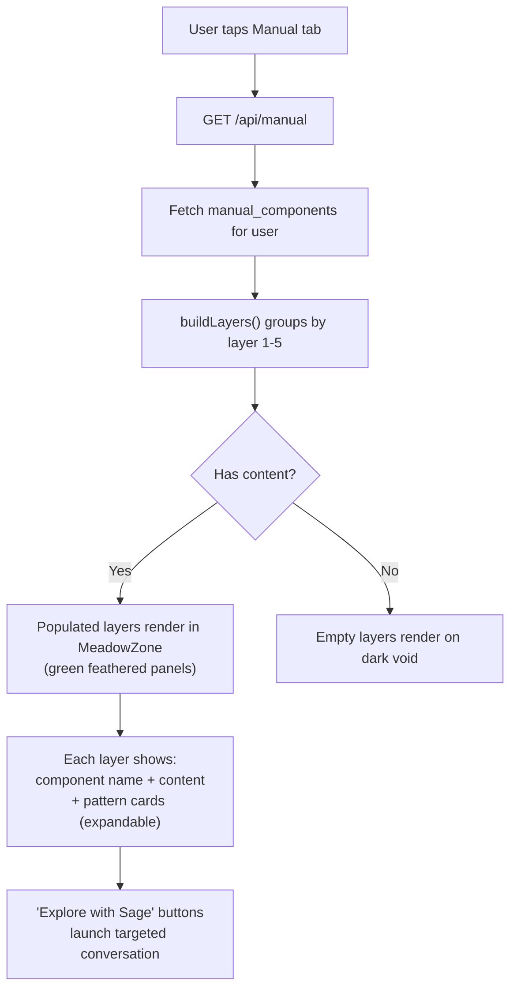
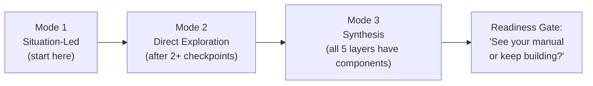

# Key User Flows

## Onboarding (new user, first visit)

## Checkpoint lifecycle (confirming a manual entry)

## Layer discovery progression

## Session flow (returning user)

## Manual view

## Conversation modes (Sage self-manages)

